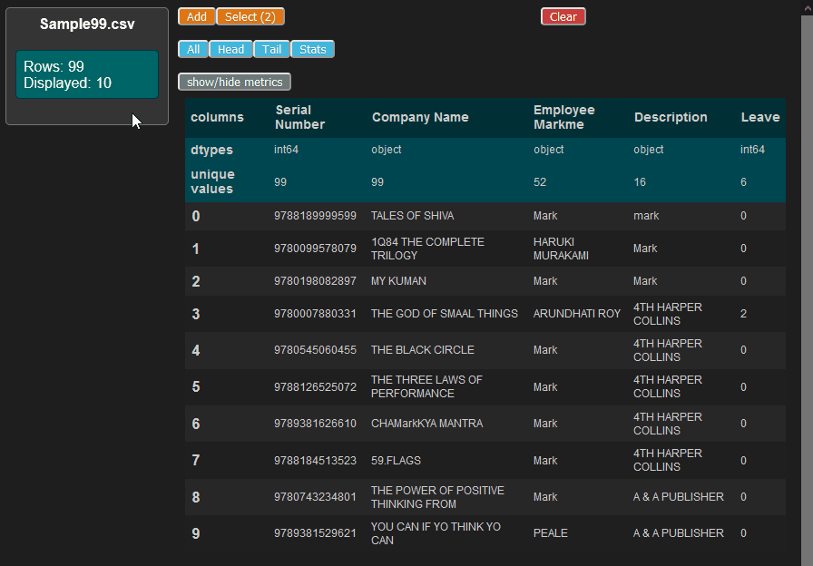
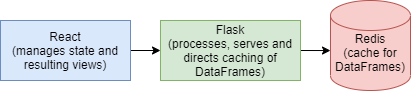
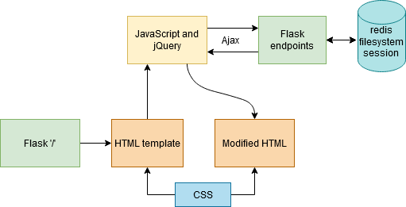

# Panda Ops 🐼

### Summary 📜

A quick way to view and edit tabular data using the [pandas](https://pandas.pydata.org/) library for Python.

I initially wrote this [using jQuery and Ajax](https://github.com/skwzrd/PandaOps-Ajax-and-jQuery) to handle the frontend, but they weren't well suited for a SPA with many updating elements. There were simply too many states and knock on effects to keep track of easily. This time I am using React to handle the frontend while sticking with a Flask API for the backend.

### Motivation 💡
There are repetitive work flows that exist when dealing with tablular data which can be made into quicker, easier processes. These include, but are not limited to:
- Quickly loading a dataset.
- Easily switching between loaded datasets.
- Getting acquainted with existing values.
- Performing simple operations on columns.
- Checking for duplicate rows.

And most importantly, being able to do all these things together seamlessly.

### Latest Update Features 👀

Column metrics have been removed from the left menu panel and placed within the dataframe table beneath column names.

### Snapshot ⏲

### Development Setup ✅

See the [getting started guide](docs/flask_react_start_project_guide.md). If you've already set up this project, use `venv\Scripts\activate && flask run` `yarn start`, in separate Command Prompts, to set up both servers.

### Current Design 📰

React manages all the states and resulting views while Flask remains stateless.

### Previous Design 📰

Below is the current SPA design that's being used. The initial HTML template that's served by Flask is modified by jQuery. When a user refreshes the page, its state gets reset to the initial HTML template. To avoid this, I added session variables in Flask that are used to propagate the correct state of the page. Now I am working towards adding something like React + Redux to make handling states easier.

